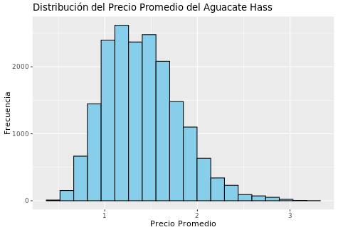
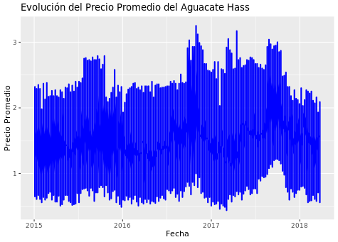
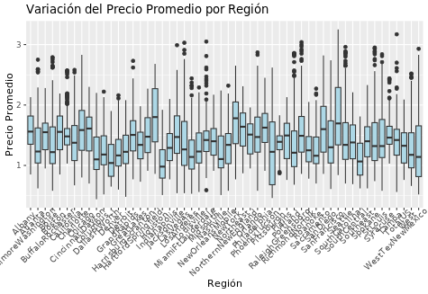
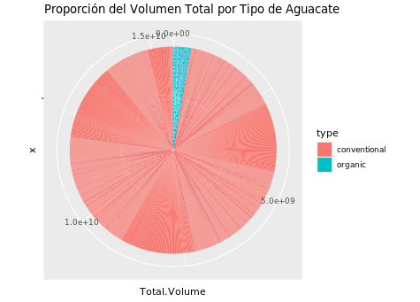
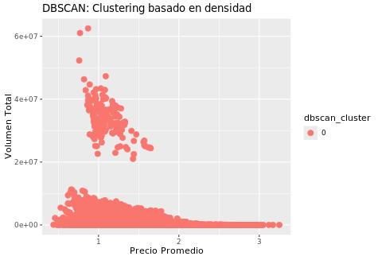
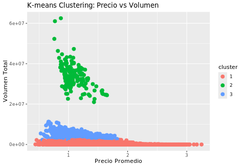
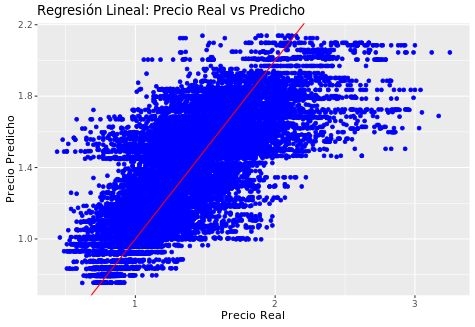
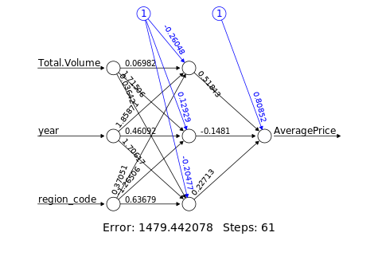

# analis-precios-paltas
kdd enfoncado en el analisis historico de la paltas

## Ejecutando el Programa

el punto del inicio del programa se encuentra en src/main.r

este script se encargara de instalar las dependecias, cargar las funciones desde otros archivos
y ejecutarlos.

```bash 
  R -q -e 'source("src/main.r")'
```

o ejecutandolo de forma manual
## plots















